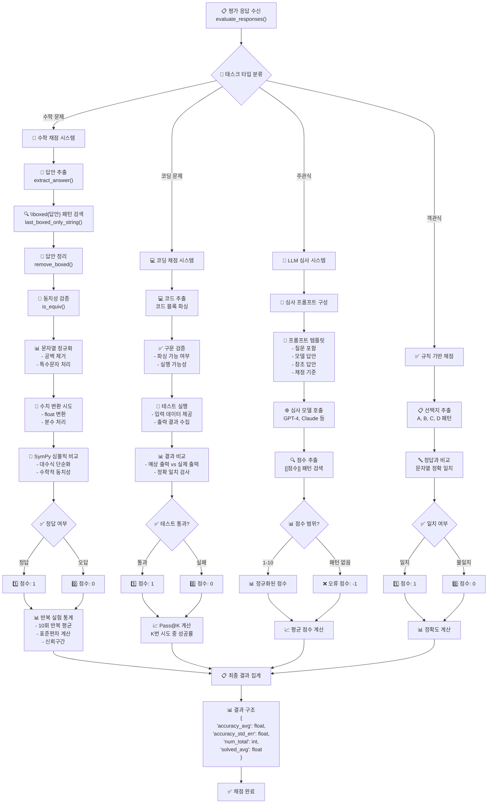

# EVAlchemy 평가 시스템 가이드

## 개요

EVAlchemy는 언어 모델의 성능을 체계적으로 평가하기 위한 종합적인 평가 시스템입니다. 이 문서는 평가 시스템의 전체적인 동작 과정을 단계별로 상세히 설명합니다.

## 전체 평가 플로우


## 시스템 아키텍처

### 핵심 구성 요소

1. **평가 엔트리포인트 (`eval.py`)**
   - 전체 평가 과정을 조율하는 메인 모듈
   - 명령줄 인터페이스 제공
   - 모델 초기화 및 결과 저장 관리

2. **태스크 매니저 (`task.py`)**
   - 다양한 벤치마크 태스크를 동적으로 로드 및 관리
   - 벤치마크 인스턴스 생성 및 실행 조율

3. **베이스 벤치마크 (`BaseBenchmark`)**
   - 모든 평가 태스크의 추상 기반 클래스
   - 일관된 평가 인터페이스 제공

4. **평가 추적기 (`eval_tracker.py`)**
   - 평가 결과 저장 및 데이터베이스 관리
   - 메타데이터 추적 및 결과 분석

## 평가 과정 상세 분석

### 1. 시스템 초기화 단계

#### 1.1 명령줄 파라미터 파싱
```bash
python -m eval.eval --model curator --tasks AIME24 --limit 1 \
--model_name "lm_studio/deepseek-r1-0528-qwen3-8b-mlx" \
--model_args "api_base=http://127.0.0.1:1234/v1,api_key=dummy" \
--apply_chat_template True --batch_size 1 \
--output_path logs/quickcheck.json
```

**주요 파라미터:**
- `--model`: 모델 타입 (curator, hf, vllm 등)
- `--tasks`: 평가할 태스크 목록 (AIME24, MATH500, HumanEval 등)
- `--model_name`: 모델 식별자
- `--model_args`: 모델별 추가 설정
- `--output_path`: 결과 저장 경로

#### 1.2 설정 파일 처리 (선택사항)
- YAML 설정 파일을 통해 배치 크기, 태스크, 어노테이터 모델 등을 일괄 설정
- 개별 파라미터보다 우선순위가 높음

#### 1.3 평가 추적기 초기화
- 파일 기반 또는 데이터베이스 기반 결과 저장 설정
- 메타데이터 추적을 위한 일반 설정 추적기 생성

### 2. 태스크 및 모델 초기화

#### 2.1 태스크 분류
평가 태스크는 두 가지 범주로 분류됩니다:

**a) 벤치마크 태스크 (Instruction-based)**
- AIME24, MATH500, HumanEval, MTBench 등
- 대화형 인터페이스 및 복잡한 채점 로직 포함
- 순차적 생성, 병렬 평가 방식 사용

**b) 사전 훈련 태스크 (Pretrain-based)**
- MMLU, HellaSwag 등 전통적인 NLP 벤치마크
- lm-evaluation-harness 프레임워크 활용

#### 2.2 태스크 매니저 초기화
```python
task_manager = InstructTaskManager(
    annotator_model=args.annotator_model,
    max_tokens=int(args.max_tokens),
    debug=args.debug,
    seed=args.seed,
    task_list=task_list,
    system_instruction=args.system_instruction,
)
```

#### 2.3 모델 초기화
- 모델 타입에 따른 적절한 백엔드 선택 (HuggingFace, VLLM, OpenAI API 등)
- 배치 크기, 생성 파라미터 설정
- 채팅 템플릿 적용 여부 확인

## 모델별 처리 과정


### 3. 응답 생성 단계

#### 3.1 인스턴스 생성
각 평가 예제에 대해 `Instance` 객체를 생성합니다:

```python
instance = Instance(
    "generate_until",  # 생성 모드
    example,           # 원본 데이터
    (
        templated_messages,  # 템플릿 적용된 메시지
        {
            "do_sample": False,
            "max_new_tokens": max_new_tokens,
            "temperature": 0.7,
            "seed": seed,
        }
    ),
    idx  # 인덱스
)
```

#### 3.2 메시지 템플릿 적용
1. **시스템 명령어 추가** (선택사항)
2. **채팅 템플릿 적용**: 모델별 대화 형식으로 변환
3. **모델별 파라미터 정규화**: 시드, 토큰 제한 등 조정

#### 3.3 모델 추론 실행
- **분산 처리**: 여러 GPU에서 병렬 처리
- **배치 처리**: 효율적인 메모리 사용
- **결과 수집**: 모든 랭크에서 결과 통합

### 4. 태스크별 응답 생성 세부 과정

#### 4.1 AIME24 수학 문제 해결
**프롬프트 형식:**
```
Problem: {problem}
Mark your solution with \boxed
Answer:
```

**생성 설정:**
- 반복 횟수: 10회 (통계적 신뢰성 확보)
- 온도: 0.7 (적당한 다양성)
- 최대 토큰: 32,768

**특수 처리:**
- 반복별 시드 값 조정으로 다양한 응답 생성
- 메타데이터에 문제 ID, 정답, 참조 해법 저장

#### 4.2 코딩 벤치마크 (HumanEval)
**프롬프트 형식:**
```
Please provide a {language} solution to the following problem:
{prompt}
```

**생성 설정:**
- 언어별 처리 (Python, JavaScript, Shell 등)
- 코드 실행을 위한 특수 형식 적용

### 5. 평가 및 채점 단계

## 채점 시스템 상세 플로우



#### 5.1 답안 추출
각 태스크별로 특화된 답안 추출 로직을 사용합니다:

**수학 문제 (AIME24, MATH500):**
```python
def extract_answer(self, output: str) -> str:
    try:
        answer = remove_boxed(last_boxed_only_string(output))
        return answer
    except:
        return ""
```

**코딩 문제:**
- 코드 블록 추출
- 구문 분석 및 실행 가능성 검증

#### 5.2 채점 방식

**a) 정확 일치 채점 (Exact Match)**
- 수학 문제: `is_equiv()` 함수로 수학적 동치성 검증
- 다중 선택: 선택지 문자 일치 확인

**b) 실행 기반 채점**
- 코딩 문제: 테스트 케이스 실행 결과 비교
- Pass@K 메트릭 계산

**c) 모델 기반 채점**
- 주관식 답안: GPT-4 등 심사 모델 활용
- 구조화된 채점 기준 적용

#### 5.3 통계 분석
```python
# 반복 실험 결과 통계 계산
solved_avg = np.mean([result["num_solved"] for result in all_results])
accuracy_avg = np.mean([result["accuracy"] for result in all_results])
accuracy_std_err = np.std([result["accuracy"] for result in all_results]) / np.sqrt(n_repeat)
```

### 6. 결과 처리 및 저장

#### 6.1 결과 집계
- 태스크별 개별 결과 수집
- 전체 평가 결과 통합
- 메타데이터 추가 (모델 정보, 실행 환경 등)

#### 6.2 저장 방식
**파일 저장:**
```json
{
  "results": {
    "AIME24": {
      "accuracy_avg": 0.65,
      "accuracy_std_err": 0.05,
      "num_total": 30,
      "solved_avg": 19.5
    }
  },
  "model_info": {
    "model_name": "deepseek-r1",
    "model_args": "api_base=...",
    "timestamp": "2024-01-01T12:00:00"
  }
}
```

**데이터베이스 저장:**
- PostgreSQL 기반 구조화된 저장
- 모델, 데이터셋, 평가 설정, 결과 테이블 관리
- 중복 평가 방지 및 이력 추적

### 7. 고급 기능

#### 7.1 분산 평가
- 여러 GPU에서 병렬 처리
- 랭크별 작업 분배
- 결과 통합 및 동기화

#### 7.2 디버그 모드
- 제한된 예제로 빠른 테스트
- 상세한 로깅 및 오류 추적

#### 7.3 데이터베이스 통합
- 평가 결과 영구 저장
- 모델 성능 비교 및 분석
- 재평가 방지 시스템

## 채점 시스템 상세

### 1. 수학 문제 채점 (`is_equiv`)

**동치성 검증 과정:**
1. 문자열 정규화 (공백, 특수문자 제거)
2. 수치 변환 및 근사 비교
3. 대수적 표현 단순화
4. SymPy를 활용한 심볼릭 비교

**예시:**
```python
# 정답: "2/3"
# 모델 답안: "0.667" → 근사치 비교로 정답 처리
# 모델 답안: "4/6" → 기약분수 변환 후 정답 처리
```

### 2. 코딩 문제 채점

**단계별 채점:**
1. **구문 분석**: 코드 파싱 가능 여부 확인
2. **테스트 실행**: 제공된 테스트 케이스 실행
3. **결과 비교**: 예상 출력과 실제 출력 비교
4. **Pass@K 계산**: K번의 시도 중 성공 횟수

### 3. 주관식 답안 채점

**GPT-4 심사 시스템:**
```python
def run_judge_single(question, answer, judge, ref_answer):
    # 심사 프롬프트 구성
    user_prompt = judge.prompt_template.format(
        question=question,
        answer=answer,
        ref_answer=ref_answer
    )
    
    # 점수 추출 패턴
    rating_pattern = r"\[\[(\d+\.?\d*)\]\]"
    match = re.search(rating_pattern, judgment)
    
    return float(match.groups()[0]) if match else -1
```

## 성능 최적화

### 1. 병렬 처리 전략
- **생성 단계**: 순차적 (GPU 메모리 제약)
- **평가 단계**: 병렬 (CPU 집약적 작업)
- **ThreadPoolExecutor**: 최적 워커 수 자동 조정

### 2. 메모리 관리
- 배치 크기 동적 조정
- 대용량 결과 스트리밍 처리
- 임시 파일 자동 정리

### 3. 캐싱 전략
- 모델 응답 캐싱
- 중복 평가 방지
- 부분 결과 복구

## 오류 처리 및 복구

### 1. 견고한 오류 처리
- 개별 예제 실패 시 전체 평가 중단 방지
- 상세한 오류 로깅 및 추적
- 부분 결과 저장 및 복구

### 2. 재시도 메커니즘
- API 호출 실패 시 자동 재시도
- 지수 백오프 적용
- 레이트 리미팅 준수

## 확장성 고려사항

### 1. 새로운 벤치마크 추가
```python
class NewBenchmark(BaseBenchmark):
    def generate_responses(self, model: LM) -> Dict[str, Any]:
        # 응답 생성 로직 구현
        pass
    
    def evaluate_responses(self, results: Dict[str, Any]) -> Dict[str, float]:
        # 평가 로직 구현
        pass
```

### 2. 새로운 모델 백엔드 지원
- lm-eval-harness 호환 인터페이스 구현
- 모델별 특수 처리 로직 추가

## 실행 예시 및 결과 해석

### 1. 기본 실행 명령어
```bash
# 단일 태스크 평가
python -m eval.eval --model curator --tasks AIME24 --limit 1 \
--model_name "lm_studio/deepseek-r1-0528-qwen3-8b-mlx" \
--model_args "api_base=http://127.0.0.1:1234/v1,api_key=dummy" \
--apply_chat_template True --batch_size 1 \
--output_path logs/quickcheck.json

# 다중 태스크 평가
python -m eval.eval --model hf --tasks "AIME24,HumanEval,MATH500" \
--model_args "pretrained=microsoft/Phi-3-mini-4k-instruct" \
--batch_size 4 --output_path logs/multi_eval.json

# 설정 파일 기반 평가
python -m eval.eval --config configs/full_evaluation.yaml \
--model_name "custom-model" --output_path logs/config_eval.json
```

### 2. 결과 구조 해석
```json
{
  "results": {
    "AIME24": {
      "accuracy_avg": 0.65,           // 평균 정확도
      "accuracy_std_err": 0.05,       // 표준 오차
      "num_total": 30,                // 전체 문제 수
      "solved_avg": 19.5,             // 평균 해결 문제 수
      "num_repeat": 10,               // 반복 실험 횟수
      "run_stats": [...]              // 실험별 상세 결과
    }
  },
  "model_info": {
    "model_name": "deepseek-r1",
    "model_args": "...",
    "timestamp": "2024-01-01T12:00:00",
    "git_hash": "abc123...",
    "total_evaluation_time": 1234.56
  }
}
```

### 3. 성능 지표 설명

**정확도 관련:**
- `accuracy_avg`: 반복 실험의 평균 정확도
- `accuracy_std_err`: 표준 오차 (신뢰도 측정)
- `solved_avg`: 평균 해결 문제 수

**통계적 신뢰성:**
- 반복 실험 (n_repeat=10)을 통한 안정적인 성능 측정
- 표준 오차를 통한 결과의 신뢰 구간 제공

이 문서는 EVAlchemy 평가 시스템의 전체적인 동작 과정을 상세히 설명합니다. 각 단계는 신뢰성, 확장성, 성능을 고려하여 설계되었으며, 다양한 언어 모델과 평가 태스크를 지원합니다.


